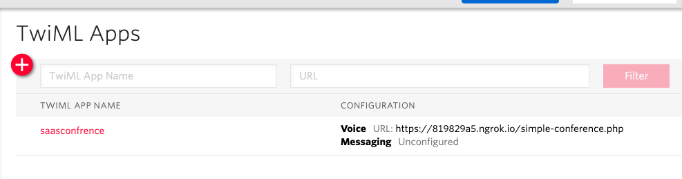

# SaasConference

Basic conferencing system built on Twilio API's

## Setup your own system

Please make sure you add a [TWiML app](https://www.twilio.com/user/account/voice/dev-tools/twiml-apps) first 

## How to dial in

* Call your Twilio Number
* Go to your website and use the Twilio javascript client

## Setup

* Add a [TwiML app](https://www.twilio.com/user/account/voice/dev-tools/twiml-apps) to your Twilio account and set the Voice URL to `http://mydomain.com/simple-conference.php` METHOD AS `HTTP GET`
* [Buy a number](https://www.twilio.com/user/account/voice/phone-numbers) from Twilio and set it to use your new TwiML app.

* Call your new number, and enter any number and ask other people to enter the same number

## Browser Connection Setup
* Grab the app's `Sid` from your [TwiML app](https://www.twilio.com/user/account/voice/dev-tools/twiml-apps) configuration
* Grab your `authToken` and `accountSid` from your [account settings](https://www.twilio.com/user/account/settings) page

* Open `config.php` and set the Sid ,accountSid,authToken,number.
* `composer install`
* Run the local php server at port say 8000 
*`php -S localhost:8000`
* ngtok is included in the bundle to start
* `./ngrok http 8000` , use the https url of ngrok as mydomain.com. http will not work.
* Go to `http://mydomain.com/index.php` and Logi into or create a room , Share with your friends.
* Tested and working on MacOS Mojave 14.x on Google chrome.
* For any bugs/advices please raise an issue.

